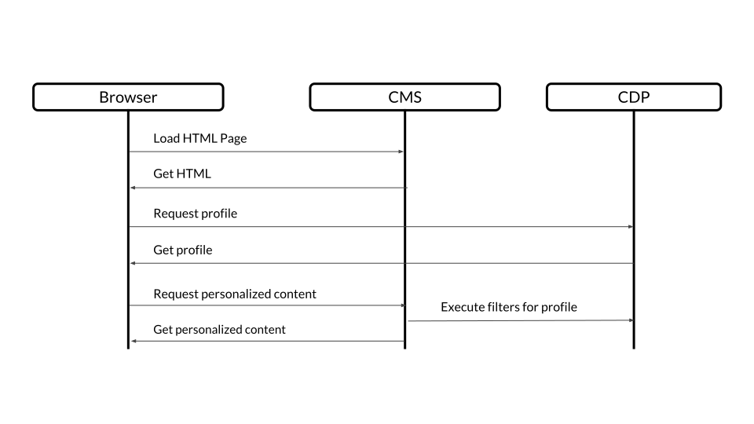
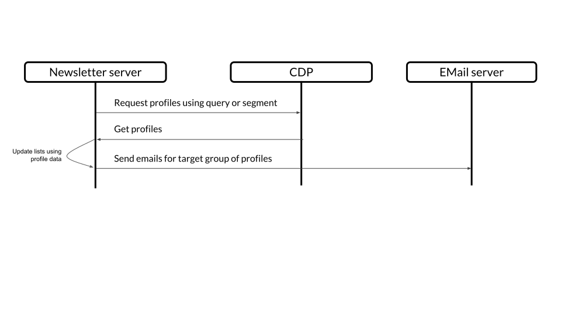
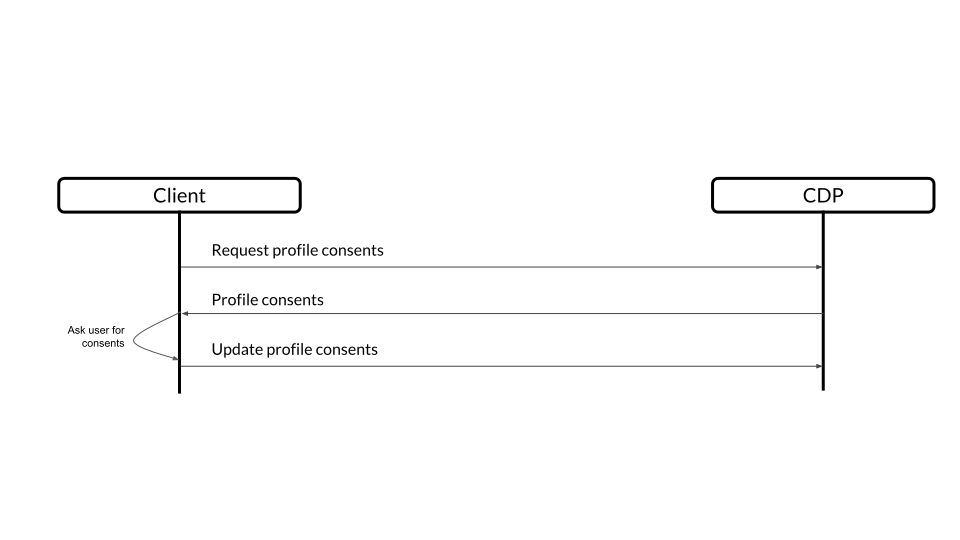

= Customer Data Platform 1.0.0 : Working Draft
:toc: macro
:toc: right
:toclevels: 4
:sectnums:
:sourcedir: ../javascript

image::images/OASISLogo-v2.0.jpg["Oasis Open Logo"]

[discrete]
== Committee Specification Draft 01 / Public Review Draft 01 (Working Draft)

[discrete]
== Not Yet Published (18 October 2018)

////
[discrete]
=== Specification URIs:
This Version:

  * http://docs.oasis-open.org/cxs/cdp/v1.0/csprd01/cdp-v1.0-csprd01.adoc (Authoritative)
  * http://docs.oasis-open.org/cxs/cdp/v1.0/csprd01/cdp-v1.0-csprd01.html
  * http://docs.oasis-open.org/cxs/cdp/v1.0/csprd01/cdp-v1.0-csprd01.pdf

Previous Version:
  N/A

Latest Version:

  * http://docs.oasis-open.org/cxs/cdp/v1.0/cdp-v1.0.txt (Authoritative)
  * http://docs.oasis-open.org/cxs/cdp/v1.0/cdp-v1.0.html
  * http://docs.oasis-open.org/cxs/cdp/v1.0/cdp-v1.0.pdf
////

[discrete]
=== Technical Committee:

OASIS Context Server (CXS) TC

[discrete]
==== Chair(s):

  * Serge Huber (shuber@jahia.com), Jahia Solutions Group SA
  * Thomas Lund Sigdestad (tsi@enonic.com), Enonic

[discrete]
==== Editor(s):

  * Thomas Lund Sigdestad (tsi@enonic.com), Enonic
  * Serge Huber (shuber@jahia.com), Jahia Solutions Group SA

[discrete]
=== Additional artifacts:

This prose specification is one component of a Work Product that also includes:

  * GraphQL sample implementation: http://docs.oasis-open.org/tc-short-name/WP-abbrev/version/csdXX/schemas/ (hyperlink, including terminating /)
  * Other parts (list full title and VISIBLE hyperlink, preferably to HTML version)

[discrete]
=== Related work:

This specification is related to:

  * GraphQL : https://graphql.org
  * GraphQL specification : https://facebook.github.io/graphql/
  *	Related specifications (VISIBLE hyperlink, preferably to HTML version)

[discrete]
=== Abstract:

This specification aims to standardize exchange of customer data across systems and silos by defining a web-based API using GraphQL, thus providing a self-documented and strongly typed interface while allowing extensive customization. It is based upon four core concepts: Profiles, Events, Consents, and Clients.

[discrete]
=== Status:

This document was last revised or approved by the OASIS Context Server (CXS) TC on the above date. The level of approval is also listed above. Check the "Latest version" location noted above for possible later revisions of this document. Any other numbered Versions and other technical work produced by the Technical Committee (TC) are listed at https://www.oasis-open.org/committees/tc_home.php?wg_abbrev=cxs#technical.

TC members should send comments on this specification to the TC's email list. Others should send comments to the TC's public comment list, after subscribing to it by following the instructions at the "Send A Comment" button on the TC's web page at https://www.oasis-open.org/committees/cxs/.

This specification is provided under the Non-Assertion Mode of the OASIS IPR Policy, the mode chosen when the Technical Committee was established. For information on whether any patents have been disclosed that may be essential to implementing this specification, and any offers of patent licensing terms, please refer to the Intellectual Property Rights section of the TC's web page (https://www.oasis-open.org/committees/cxs/ipr.php).

Note that any machine-readable content (Computer Language Definitions) declared Normative for this Work Product is provided in separate plain text files. In the event of a discrepancy between any such plain text file and display content in the Work Product's prose narrative document(s), the content in the separate plain text file prevails.

[discrete]
=== Citation format:

When referencing this specification the following citation format should be used:

*CDP-v1.0*

_Customer Data Platform Version 1.0_. Edited by Thomas Lund Sigdestad. 12 October 2018. OASIS Committee Specification Draft 01 / Public Review Draft 01. http://docs.oasis-open.org/cxs/cdp/v1.0/csprd01/cdp-v1.0-csprd01.html. Latest version: http://docs.oasis-open.org/cxs/cdp/v1.0/cdp-v1.0.html.

[discrete]
== Notices

Copyright © OASIS Open 2018. All Rights Reserved.

All capitalized terms in the following text have the meanings assigned to them in the OASIS Intellectual Property Rights Policy (the "OASIS IPR Policy"). The full Policy may be found at the OASIS website.

This document and translations of it may be copied and furnished to others, and derivative works that comment on or otherwise explain it or assist in its implementation may be prepared, copied, published, and distributed, in whole or in part, without restriction of any kind, provided that the above copyright notice and this section are included on all such copies and derivative works. However, this document itself may not be modified in any way, including by removing the copyright notice or references to OASIS, except as needed for the purpose of developing any document or deliverable produced by an OASIS Technical Committee (in which case the rules applicable to copyrights, as set forth in the OASIS IPR Policy, must be followed) or as required to translate it into languages other than English.

The limited permissions granted above are perpetual and will not be revoked by OASIS or its successors or assigns.

This document and the information contained herein is provided on an "AS IS" basis and OASIS DISCLAIMS ALL WARRANTIES, EXPRESS OR IMPLIED, INCLUDING BUT NOT LIMITED TO ANY WARRANTY THAT THE USE OF THE INFORMATION HEREIN WILL NOT INFRINGE ANY OWNERSHIP RIGHTS OR ANY IMPLIED WARRANTIES OF MERCHANTABILITY OR FITNESS FOR A PARTICULAR PURPOSE.

OASIS requests that any OASIS Party or any other party that believes it has patent claims that would necessarily be infringed by implementations of this OASIS Committee Specification or OASIS Standard, to notify OASIS TC Administrator and provide an indication of its willingness to grant patent licenses to such patent claims in a manner consistent with the IPR Mode of the OASIS Technical Committee that produced this specification.

OASIS invites any party to contact the OASIS TC Administrator if it is aware of a claim of ownership of any patent claims that would necessarily be infringed by implementations of this specification by a patent holder that is not willing to provide a license to such patent claims in a manner consistent with the IPR Mode of the OASIS Technical Committee that produced this specification. OASIS may include such claims on its website, but disclaims any obligation to do so.

OASIS takes no posi tion regarding the validity or scope of any intellectual property or other rights that might be claimed to pertain to the implementation or use of the technology described in this document or the extent to which any license under such rights might or might not be available; neither does it represent that it has made any effort to identify any such rights. Information on OASIS' procedures with respect to rights in any document or deliverable produced by an OASIS Technical Committee can be found on the OASIS website. Copies of claims of rights made available for publication and any assurances of licenses to be made available, or the result of an attempt made to obtain a general license or permission for the use of such proprietary rights by implementers or users of this OASIS Committee Specification or OASIS Standard, can be obtained from the OASIS TC Administrator. OASIS makes no representation that any information or list of intellectual property rights will at any time be complete, or that any claims in such list are, in fact, Essential Claims.

The name "OASIS" is a trademark of OASIS, the owner and developer of this specification, and should be used only to refer to the organization and its official outputs. OASIS welcomes reference to, and implementation and use of, specifications, while reserving the right to enforce its marks against misleading uses. Please see https://www.oasis-open.org/policies-guidelines/trademark for above guidance.

toc::[]

== Introduction

Today, virtually all business is at some point digital, and the number of systems involved and the set of data collected is growing rapidly.
Each system creates new silos of customer data, spreading sensitive and personal data across both organizational and geographical borders.

Even digital savvy businesses struggle to control and utilize this information.
Businesses and users also rely on such data to be accessible in real-time, and at scale - for instance to deliver personalizations.
Additionally businesses now face severe legal charges if customer data is not treated according to regulatory requirements (ref GDPR).

The Customer Data Platform (CDP) specification aims to standardize exchange of customer data across systems and silos.
This enables centralization of customer data - consequently giving control of the data back to the business, and the customers.

The CDP standard is defined as a web-based API using GraphQL - providing a self-documented and strongly typed interface.

It has been an explicit goal of the CXS committee to allow extensive customization of CDP deployments, in order to fit the need of each different organization.
As such, the API dynamically evolves as you customize your deployment.

=== Terminology

The key words "MUST", "MUST NOT", "REQUIRED", "SHALL", "SHALL NOT", "SHOULD", "SHOULD NOT", "RECOMMENDED", "MAY", and "OPTIONAL" in this document are to be interpreted as described in [RFC2119] and [RFC8174] when, and only when, they appear in all capitals, as shown here.

=== Normative References

  \[RFC2119]	Bradner, S., "Key words for use in RFCs to Indicate Requirement Levels", BCP 14, RFC 2119, DOI 10.17487/RFC2119, March 1997, <http://www.rfc-editor.org/info/rfc2119>.
  \[RFC8174]	Leiba, B., "Ambiguity of Uppercase vs Lowercase in RFC 2119 Key Words", BCP 14, RFC 8174, DOI 10.17487/RFC8174, May 2017, <http://www.rfc-editor.org/info/rfc8174>.
  \[Reference]	\[Full reference citation]

=== Non-Normative References

  \[RFC3552]	Rescorla, E. and B. Korver, "Guidelines for Writing RFC Text on Security Considerations", BCP 72, RFC 3552, DOI 10.17487/RFC3552, July 2003, <https://www.rfc-editor.org/info/rfc3552>.
  \[Reference]	\[Full reference citation]

== Use Cases

In this section we present a few use cases that are relevant to the scope covered by the CDP specification. They are by
no means exhaustive and serve primarly as illustrations of what may be achieved using servers that implement the
standard.

=== Personalization

The first and most common use case is the case of delivering personalized experiences on (desktop or mobile) web sites.

As illustrated above, the browser can interact with both a Content Management System (CMS) and a CDP-compliant server
to first retrieve the HTML needed to deliver the page content. After this the next request to the CMS is a request
for personalized content that will be customized based on the profile retrieved from the CDP. The result is personalized
content for the current visitor being sent back to the browser.

This illustration is by no means the only way to implement personalization using a CDP but it serves as a simple
introduction to the possibilies such a system may offer.

=== Newsletters

This use case is relevant to users interested in delivering newsletters to the proper audience. For example it might be
interesting to send a newsletter to promote a product to a group of profiles that has not purchased the product before,
but it would not be a good idea to send it to people that have already purchased it.

In the above illustration the newsletter server can query the CDP for a group of profile using either a query or a pre-
defined segment to retrieve the subset of profiles it is interested in. Once those profiles are retrieved they may be
used to update the newsletters management system lists with information coming from those exported profiles. And finally,
when the newsletter is ready to be distributed, the updated lists may be used to send the emails using an email delivery
server.

=== Privacy

Privacy is a very important topic, especially when dealing with visitor data. For example, new legislation such as the
https://eugdpr.org[GDPR] imposes strict restrictions on how visitor data collection should be processed. It is therefore
very important that the CDP specification provide standardized ways of complying with more and more stringent
requirements.

In the above use case we illustrate the support of consent management that is available in CDP-compliant systems. A
visitor profile may store the state of consents (granted or not) and these may be updated by using specialized event
types.

Other use cases for privacy include profile downloading, being able to anonymize visitor data, as well as deleting
profiles.

=== A/B testing

CDP systems may also be used to deliver A/B testing experiences. In this use case, the CDP server will use the visitor
profile information by updating it with the variants that the visitor has been exposed to, effectively "classifying" the
visitor into a sub-group.

image::images/cdp-abtesting-usecase.svg["A/B testing use case diagram"]

In the above illustration, this use case is implemented by using a CMS to deliver the different variants of content that
are hidden by default. After that, the CDP is asked whether the profile is in variant A or B, which might be implemented
in different fashions but they will be remembered by the CDP for future displays.

== Domain objects

Below is a short introduction to the core domain objects of the specification:

Events:: <<Events>> represent the stream of "customer behaviour" events that help the CDP build <<Profiles>>
Profiles:: Representing the data of the subject, or "customer" interacting with your business <<Objects>>
Personas:: Create <<Personas>> to simulate real <<Profiles>> and test your ideas
Objects:: Are the target items (and possibly persons) a "customer" interacts with
Lists:: Manually or programatically updated <<Lists>> of profiles
Segments:: <<Segments>> are dynamic lists based on <<Filters>>
Consents:: <<Consents>> granted or denied by the subjects
Properties: Allow the definition of custom profile <<Properties>> within a CDP deployment
Clients:: <<Clients>> represent any entity connecting to CDP, either for storing or retrieving data
Views:: Create dministrative <<Views>> for grouping objects defined by back-office users
Interest:: Represents a profiles weighted <<Interest>> in a specific <<Topic>>
Topics:: Represent "business areas" of an organisation deploying CDP - like a product or a location.
Filters:: Enable definition of structured queries against other CDP domain objects

== API Reference

The Customer Data Platform (CDP) standard is built around a set of concepts, domain objects and services for interacting with them.
This is represented through a strongly typed API defined through GraphQL Types, Queries, Mutations and Subscriptions.

Each section in the API reference will usually start with a description of the domain objects and then include the normative GraphQL types, queries and mutations relevant to the domain objects.

This chapter describes the API in detail.

GraphQL requests are usually composed of two parts : `operations` and `variables`.

Throughout this document we will provide GraphQL request examples in the following form:

operation::

    GraphQL query, mutation or subscription

variables::

    JSON structure

.Example operation
[source,graphql]
----
query getExistingProfile($profileId : CDP_ProfileIDInput) {
  cdp {
    getProfile(createIfMissing: false, profileID: $profileId) {
      _profileIDs {
        id
      }
    }
  }
}
----

What the above query does is retrieve all the profileIDs for a existing profile (that's why we set the createIfMissing
argument to false). We also define a variable called $profileId that must be passed in the "variables" section of the
GraphQL request. Here's an example of the `variables part:

.Example variables
[source,graphql]
----
{
  "profileId": {
    "source": {"id": "jahia.com", "thirdParty": false},
    "id": "0bb99ae7-0571-4b5f-8267-978731cb62c2"
  }
}
----

As illustrated above, the variables may contain complex JSON structure that represent the values for the objects that
are passed as GraphQL arguments.

NOTE: The most efficient way to explore the GraphQL API is by starting the sample CDP server TODO

=== Scalars

GraphQL provides several basic value types that are used extensively in this specification, for instance Int and String.
However, the CDP specification is also handling other value types in a similar fashion. As such, the following scalars have been added:

==== JSON
For values and arguments that cannot be defined structurally

  Scalar JSON

==== Date
For consistent representation of dates. Based on RFC-3339, for example 1996-12-19, see https://github.com/graphql-java/graphql-java-extended-scalars for example implementation

  Scalar Date

==== Time
For consistent representation of time. Based on RFC-3339, for example 16:39:57-08:00, see https://github.com/graphql-java/graphql-java-extended-scalars for example implementation

  Scalar Time

==== DateTime
For consistent representation of date and time. Based on RFC-3339, for example 1996-12-19T16:39:57-08:00, see https://github.com/graphql-java/graphql-java-extended-scalars for example implementation

  Scalar DateTime

==== GeoPoint
Uses a string representation of lat,lon

  Scalar GeoPoint

=== Properties

To properly store and query data CDP needs a way to describe the data dynamically.

A Property represents data stored in a key-value format.
A single property can hold a single value, or an ordered array of values.
Each property has a specific valueType to limit what kind of values it may hold.
These are ``Identifier``,``String``, ``Int``, ``Float``, ``Date``, ``Boolean``, ``GeoPoint``, ``Enumeration`` and ``Set``.

Below are some examples of properties:

* fullName(String) : "Jane Doe"
* birthDate(Date) : "2003-07-01"
* someInteger(Integer) : 1337
* gender(Enumeration) : FEMALE
* location(GeoPoint) : "lat,lon"
* arrayOfStrings([String]) : ["This", "is", "nice"]
* setOfProperties(Set) : {prompt : "hello", response : "yo"}

In the case of the enumeration value type, a GraphQL enum type will be generated based on the registered possible values for the property.

The Set value type is special, as it enables nested properties and a tree-structure of properties.
I.e. from the example above: "setOfProperties.response" would hold the value "yo"

A property consists of:

* the property name (it is RECOMMENDED but not mandatory to prefix the property name)
* the valueType of the property (Identifier, String, Int, Float, Date, Boolean, GeoPoint, Enumeration and Set)
* minimum occurrences of values (a property may hold one or more values)
* maximum occurrences

Since the CDP api is defined using strongly typed GraphQL,
the API is dynamically updated when properties are added or changed.

==== CDP_Property

The property interface defines the common fields for the different value types.

[source,graphql]
----
include::{sourcedir}/schemas/properties.js[lines=5..10]
----

name:: must be in a format that's acceptable as a GraphQL field name (/[_A-Za-z][_0-9A-Za-z]*/) , and we RECOMMEND to prefix it to avoid conflicts, i.e acme_pageView, acme_click. "cdp_" is reserved.
minOccurences:: Default = 0. For minOccurrences > 1 the property can hold multiple values in preserved order. minOccurences = 1 indicates the property is mandatory.
maxOccurences:: Default = 1. maxOccurences = 0 indicates no limit. maxOccurences must be higher than minOccurences.
tags:: System defined/generated tags. E.g: hidden, readOnly, personalData

==== CDP_PropertyInput

This type is a workaround for missing inheritance in GraphQL.
Only one field may be used at a time, all other fields must be null.

[source,graphql]
----
include::{sourcedir}/schemas/properties.js[lines=15..25]
----

==== CDP_BooleanProperty

[source,graphql]
----
include::{sourcedir}/schemas/properties/boolean.js[lines=2..8]
----

==== CDP_BooleanPropertyInput

[source,graphql]
----
include::{sourcedir}/schemas/properties/boolean.js[lines=10..16]
----

==== CDP_DateProperty

[source,graphql]
----
include::{sourcedir}/schemas/properties/date.js[lines=5..11]
----

==== CDP_DatePropertyInput

[source,graphql]
----
include::{sourcedir}/schemas/properties/date.js[lines=13..19]
----

==== CDP_EnumProperty

[source,graphql]
----
include::{sourcedir}/schemas/properties/enum.js[lines=5..11]
----

==== CDP_EnumPropertyInput

[source,graphql]
----
include::{sourcedir}/schemas/properties/enum.js[lines=13..19]
----

==== CDP_FloatProperty

[source,graphql]
----
include::{sourcedir}/schemas/properties/float.js[lines=2..10]
----

==== CDP_FloatPropertyInput

[source,graphql]
----
include::{sourcedir}/schemas/properties/float.js[lines=12..20]
----

==== CDP_GeoPointProperty

[source,graphql]
----
include::{sourcedir}/schemas/properties/geopoint.js[lines=5..11]
----

==== CDP_GeoPointPropertyInput

[source,graphql]
----
include::{sourcedir}/schemas/properties/geopoint.js[lines=13..19]
----

==== CDP_IdentifierProperty

[source,graphql]
----
include::{sourcedir}/schemas/properties/identifier.js[lines=5..12]
----

==== CDP_IdentifierPropertyInput

[source,graphql]
----
include::{sourcedir}/schemas/properties/identifier.js[lines=14..21]
----

==== CDP_IntProperty

[source,graphql]
----
include::{sourcedir}/schemas/properties/int.js[lines=2..10]
----

==== CDP_IntPropertyInput

[source,graphql]
----
include::{sourcedir}/schemas/properties/int.js[lines=12..20]
----

==== CDP_StringProperty

[source,graphql]
----
include::{sourcedir}/schemas/properties/string.js[lines=2..9]
----

==== CDP_StringPropertyInput

[source,graphql]
----
include::{sourcedir}/schemas/properties/string.js[lines=11..18]
----

==== CDP_SetProperty

[source,graphql]
----
include::{sourcedir}/schemas/properties/set.js[lines=5..11]
----

==== CDP_SetPropertyInput

[source,graphql]
----
include::{sourcedir}/schemas/properties/set.js[lines=13..19]
----

=== Filters

Filters are widely used in CDP, and enable querying profiles, events, and other CDP objects.
Filters are designed to be easy to use for administrators and marketeers in visual user interfaces, but also in terms of technical implementation.

Filters are essentially composed from basic property comparison expressions, and may be chained with the operators AND and OR, where AND is used by default.
GraphQL fields will be generated the following way:

    PROPERTYNAME + "_" + OPERATOR

For each operator available on the property value type a GraphQL field will be generated.

A single filter may only operate on a specified CDP object (i.e. profile or event).

The following comparison operators are available:

.Operator availability for property value types
[options="header"]
|================================================================================
|Operators  |Identifier|String|Int|Float|Date|Boolean|GeoPoint|Enumeration|Array|
|equals     |x         |x     |x  |x    |x   |x      |x       |x          |     |
|startsWith*|          |x     |   |     |    |       |        |           |     |
|endsWith*  |          |x     |   |     |    |       |        |           |     |
|contains   |          |x*    |   |     |    |       |        |           |x    |
|regexp*    |          |x     |   |     |    |       |        |           |     |
|lt         |          |      |x  |x    |x   |       |        |           |     |
|lte        |          |      |x  |x    |x   |       |        |           |     |
|gt         |          |      |x  |x    |x   |       |        |           |     |
|gte        |          |      |x  |x    |x   |       |        |           |     |
|distance   |          |      |   |     |    |       |x       |           |     |
|================================================================================

* optional operators

The `Array` column is a special case. It can be an array of any GraphQL type. In this case only the `contains` operator
is defined in the specification, but implementations are free to offer more advanced operators for this type.

As we are expressing filters through GraphQL, filters will always be strongly typed.
I.e. if the property "firstName" with valueType string is available, the following options can be used:

  firstName_equals
  firstName_startsWith (optional)
  firstName_endsWith (optional)
  firstName_contains
  firstName_regexp (optional)

Below are some basic filter examples:

  { "firstName_equals" : "Serge" }

  { "birthDate_greaterThan" : "1970-01-01" }

  {
    "location_distance" : {
      "center" : { "longitude" : 59.91273, "latitude": 10.74609 },
      "unit" : "KILOMETERS",
      "distance" : 5
    }
  }

  {
    "or" : [
      { "firstName_equals" : "Serge" },
      { "birthDate_greaterThan" : "1970-01-01" }
    ]
  }

==== Ordering

OrderBy is used in combination with filters and lets you sort the result based on properties available for the returned objects.

Example:

  "orderBy": [{
    "property": "firstName",
    "order": "ASC"
    }
  ]

==== CDP_SortOrder

Enumeration of allowed sorting operators

[source,graphql]
----
include::{sourcedir}/schemas/filters.js[lines=2..6]
----

==== CDP_OrderByInput

[source,graphql]
----
include::{sourcedir}/schemas/filters.js[lines=8..11]
----

fieldName:: Specify the field to sort by, i.e. "endTime", "properties.location"

==== CDP_DateFilter

[source,graphql]
----
include::{sourcedir}/schemas/filters.js[lines=13..18]
----

==== CDP_DateFilterInput

[source,graphql]
----
include::{sourcedir}/schemas/filters.js[lines=20..25]
----

==== CDP_GeoDistanceFilterUnit

[source,graphql]
----
include::{sourcedir}/schemas/filters.js[lines=27..31]
----

==== CDP_GeoDistanceFilter

[source,graphql]
----
include::{sourcedir}/schemas/filters.js[lines=33..37]
----

==== CDP_GeoDistanceFilterInput

[source,graphql]
----
include::{sourcedir}/schemas/filters.js[lines=39..43]
----

=== Clients

The CDP GraphQL API should only be accessible for specific authorized clients.

Client represent any software that interacts directly with the Customer Data Platform.

Examples of clients are:

* Cookie-based (Javascript or other) tracker for website(s)
* Integration with your CRM
* Integration with your Identity System

Each Client is responsible for uniquely identifying visitors, for instance through the use of a cookie on the website, a customer ID in the CRM or a user ID in the Identity system.
The Customer Data Platform requires <<profileIDs>> to be unique within every client.
For instance, if a client is used to track visitors across multiple websites, it should aim to re-use the same <<profileID>> across all of them, for the same visitor.

NOTE: The standard does not specify Queries or Mutations for creating or retrieving Clients in the CDP specification, as this is considered an implementation-specific feature.
For any CDP implementation, a Client MUST be defined before it can access the API.

==== CDP_Client

[source,graphql]
----
include::{sourcedir}/schemas/client.js[lines=2..6]
----

=== Sources
Sources are optional, but represent a way to identify the exact origin of events within a client.
For instance, a web tracking script may track visitors across many different sites, but treat each site as a source.
As such, sources are comparable to siteID's in Google Analytics.

==== CDP_Source

[source,graphql]
----
include::{sourcedir}/schemas/sources.js[lines=2..5]
----

==== CDP_SourceInput

[source,graphql]
----
include::{sourcedir}/schemas/sources.js[lines=7..10]
----

* *id* The "system" source ID is reserved for internal use by the CDP.
* *thirdParty* Optional, indicates that the source is a third party (useful for privacy regulations such as GDPR)

==== CDP_Query

.Source related queries
[source,graphql]
----
include::{sourcedir}/schemas/sources.js[lines=13..13]
----

==== CDP_Mutation

.Source related mutations
[source,graphql]
----
include::{sourcedir}/schemas/sources.js[lines=17..18]
----

=== Objects

Objects are representations of anything users interact with. For example: a web page, a product or another person.
Objects are used in <<Events>> to specify what the <<Profiles>> are interacting with. Objects are also used in <<Optimizations>>.

Objects may be part of one or more collections.
Collections are used to classify objects.
By placing objects into collections, optimizations may execute on a reduced data set (i.e. : recommending products).

==== CDP_Object

[source,graphql]
----
include::{sourcedir}/schemas/objects.js[lines=2..5]
----

id:: Unique within each specified collection
collection:: A way of classifying objects. Use URIs, e.g. schema.org (http://schema.org/Product) or reverse domain naming convention (org.acme.Product)

==== CDP_ObjectInput

[source,graphql]
----
include::{sourcedir}/schemas/objects.js[lines=7..10]
----

=== Events
Events are what drives the Customer Data Platform forward.
Events are collected from different Clients, such as a specific website, beacons, commerce systems or a CRM.

A single Client might still produce many different profiles for a "real person".
For instance - if a visitor uses different devices on a single web page, each device will produce a new profile, with a unique profileID.

The Customer Data Platform is essentially interested in "User behavioral events".
An event could be anything from someone clicking a link, to performing a transaction or consenting to use of his/hers information.
Events are streamed or delivered from authorized <<Clients>> to the Customer Data Platform.

As an example: Imagine an e-commerce site with a client that collect events from its visitors.
When a visitor browses the site with his laptop, the client assigns a cookie to his/her browser and starts feeding events to the CDP API.
As the visitor click on some product links, and maybe fills in a form that includes e-mail. CDP will gradually populate a profile, using the cookie value as an ID.
At a later point, the same visitor picks up a different device and returns to the site. As the client cannot know this is the same individual, a new cookie is generated, and a new profile starts to build up.

A single client may be used to track <<Events>> from a number of different websites, where each website can be tagged with a source.
Sources provide a way to identify the exact origin of the events beyond the client.
As such, sources are comparable to siteID's in Google Analytics.

==== EventTypes

Events must always be of a specific type.
CDP implementations must implement a set of standard EventTypes, any other EventTypes are implementation specific.

For flexibility reasons, implementers are encouraged to make EventTypes pluggable.
Implementation specific, or pluggable EventTypes SHOULD be registered with a prefix, to avoid naming conflicts.
All standard EventTypes will be prefixed with CDP.

In the CDP, every EventType will need both an regular GraphQL type, and a GraphQL input.

NOTE: EventType fields MUST match the CDP propertyType format, and its underlying valueTypes

Below are examples of what custom EventTypes might look like:

.Sample EventType for Page Views
[source,GraphQL]
----
input VENDOR_PageViewEvent {
  pageID : String,
  language : String,
  pageUrl : String,
  referrer : String,
  userAgent : String
}
----

.Sample EventType for CRM updates
[source,javascript]
----
input VENDOR_crmLeadEvent {
  leadStatus : String,
  leadID : String,
  firstName : String,
  lastName : String,
  email : String
}
----

Example event types include :

- Updating profile properties, needs to match the profile properties definitions (built-in)
- Session start/paused/resumed/stopped (built-in)
- Updating consent ( see http://ec.europa.eu/ipg/basics/legal/cookies/index_en.htm ) (built-in)
- Opt-in / opt-out of a list (built-in)
- Transaction (generic)
- Like (“user likes a product”)
- Dislike (“visitor dislikes a comment”)
- Abuse, “user reports abuse on a page”
- Rate (score in percent) “user rates product 4 out of 5 stars”
- Vote
- Download (“user downloaded a digital product”)
- Register/Submission
- Login
- Logout
- RequestFriendship
- AcceptFriendship
- DenyFriendship
- Click
- View
- Contribute (comment, blog etc?)
- Conversion (purchase, download, signs up for a service

==== CDP_EventInterface

Events make use of type inheritance.
To avoid name space conflicts, all standard event fields are prefixed with ´´_´´.

[source,graphql]
----
include::{sourcedir}/schemas/events.js[lines=2..12]
----

==== CDP_EventInput

[source,graphql]
----
include::{sourcedir}/schemas/events.js[lines=19..36]
----

==== CDP_Query

.Event queries
[source,graphql]
----
include::{sourcedir}/schemas/events.js[lines=39..40]
----

==== CDP_Mutation

.Event mutations
[source,graphql]
----
include::{sourcedir}/schemas/events.js[lines=44..44]
----

==== CDP_Subscriptions

.Event subscriptions
[source,graphql]
----
include::{sourcedir}/schemas/events.js[lines=48..48]
----

==== Event processing sample

.Mutation
[source,GraphQL]
----
mutation profileUpdateExample($events: [CDP_EventInput]!) {
  cdp {
    processEvents(events: $events)
  }
}
----

.Mutation variables
[source,GraphQL]
----
{"events": [
  {
    "_profileID": {
      "id": "1234567890",
      "source": {"id": "jahia.com"}},
    "_object": { "id": "//jahia.com/aboutUs", "collections": ["http://schema.org/WebPage"]},
    "pageViewEvent": {
      "language" : "en"
    }
  }
]}
----

=== EventFilters

EventFilters are a specific version of filters for querying events.

Example: Filter for identifying events of type `transaction` within the last 30 days.

operation::

[source,GraphQL]
----
query findEvents($filter: CDP_EventFilterInput) {
  cdp {
    findEvents(filter: $filter) {
      edges {
        node {
          __typename
        }
      }
    }
  }
}
----

variables::

[source,GraphQL]
----
{
  "filter" : {
    "_timestamp_between" : {
      "after" : "2018-06-28T05:25:28+00:00",
      "before" : "2018-06-28T06:25:28+00:00",
      "includeBefore": false,
      "includeAfter": false
    },
      "_profileUpdateEvent" : {
      "firstName_startsWith" : "T",
      "lastName_endsWith" : "d"
    }
  }
}
----

==== CDP_EventFilter

[source,graphql]
----
include::{sourcedir}/schemas/eventfilters.js[lines=2..22]
----

==== CDP_EventFilterInput

[source,graphql]
----
include::{sourcedir}/schemas/eventfilters.js[lines=24..43]
----

=== Profiles
Profiles are in many ways the holy grail of CDP.
The Customer Data Platform dynamically creates and build profiles from events that occur over time.

A Profile can be created from an anonymous visitor on a webpage, populated from an identity system, a CRM, or the combination of all of them.

Different <<Clients>> like a website tracking script, CRM or identity system can be configured to feed <<Events>> to the Customer Data Platform.

The Customer Data Platform is responsible for building profiles based on the provided identifiers and the stream of events coming from each Client.

==== Profile properties

Each deployment of CDP will be unique in how data are collected, and what data is stored per profile.
Profile properties enable us to define custom properties required by an organization.

Administrators and developers may define and maintain a consistent data model for profiles across different <<Clients>> and <<Sources>>.
Any data to be recorded in a profile must be mapped to a corresponding profile property.

The specification does not define a set of standard profile properties. However, implementors SHOULD include the following standard properties :

- fullName : string
- email : identifier
- phoneNumber : identifier

Profiles are updated through events.
The history of external or internal profile modifications is accessible through the profile update events.
CDP implementations SHOULD also support <<CDP_Subscription,subscriptions>> on profile modifications so that external systems can retrieve the profile modifications in real-time.

Properties can be dynamically defined for profiles using the ``createOrUpdateProfileProperties`` and ``deleteProfileProperties`` mutations. Once a property is associated with a profile, it will become available in the CDP_Profile and CDP_Persona types.

As an example, let's assume we have a starting CDP_Profile type that looks like this:

[source,graphql]
----
type CDP_Profile implements CDP_ProfileInterface {
  _profileIDs : [CDP_ProfileID]
  _events(filter : CDP_EventFilterInput, first : Int, last: Int, after : String, before: String) : CDP_EventConnection
  _lastEvents(count : Int, profileID : CDP_ProfileIDInput) : CDP_EventConnection
  _segments(views : [ID]) : [CDP_Segment]
  _interests(views : [ID]) : [CDP_Interest]
  _consents : [CDP_Consent]
  _lists(views : [ID]) : [CDP_List]
  _matches(namedFilters : [CDP_NamedFilterInput]) : [CDP_FilterMatch]
  _optimize(parameters : [CDP_OptimizationInput]) : [CDP_OptimizationResult]
  _recommend(parameters : [CDP_RecommendationInput]) : [CDP_RecommendationResult]
  # fields will be added here according to registered profile properties
}
----

Now let's use the mutation to create a new property.

operation::

[source,graphql]
----
mutation addProperties($properties: [CDP_PropertyInput]) {
  cdp {
    createOrUpdateProfileProperties(properties: $properties)
  }
}
----

variables::

[source,graphql]
----
{
  "properties": [
    {
      "string": {
        "name": "firstName"
      }
    },
    {
      "set": {
        "name": "sample_Address",
        "properties": {
          "string": {"name": "streetName"},
          "string": {"name": "postalCode"}
        }
      }
    }
  ]
}----

This will resulting in the following modifications to the CDP_Profile type:

[source,graphql]
----
type CDP_Profile implements CDP_ProfileInterface {
  _profileIDs : [CDP_ProfileID]
  _events(filter : CDP_EventFilterInput, first : Int, last: Int, after : String, before: String) : CDP_EventConnection
  _lastEvents(count : Int, profileID : CDP_ProfileIDInput) : CDP_EventConnection
  _segments(views : [ID]) : [CDP_Segment]
  _interests(views : [ID]) : [CDP_Interest]
  _consents : [CDP_Consent]
  _lists(views : [ID]) : [CDP_List]
  _matches(namedFilters : [CDP_NamedFilterInput]) : [CDP_FilterMatch]
  _optimize(parameters : [CDP_OptimizationInput]) : [CDP_OptimizationResult]
  _recommend(parameters : [CDP_RecommendationInput]) : [CDP_RecommendationResult]
  # fields will be added here according to registered profile properties
  firstName : String
  sample_Address : Sample_Address
}
----

The following type is generated from the property definition. The name of the type starts with an uppercased character from the
property name.

[source,graphql]
----
type Sample_Address {
  streetName : String,
  postalCode : String
}
----

This will also generate new filter fields in the <<CDP_ProfilePropertiesFilterInput>> type:

[source,graphql]
----
type CDP_ProfilePropertiesFilter {
  and : [CDP_ProfilePropertiesFilter]
  or : [CDP_ProfilePropertiesFilter]
  # generated profile properties filters will be listed below
  firstName_equals : String,
  firstName_contains : String
  sample_Address : Sample_AddressFilter
}

type Sample_AddressFilter {
  streetName_equals : String,
  streetName_contains : String,
  postalCode_equals : String,
  streetName_contains : String
}

input CDP_ProfilePropertiesFilterInput {
  and : [CDP_ProfilePropertiesFilterInput]
  or : CDP_ProfilePropertiesFilterInput
  # generated profile properties filters will be listed below
  firstName_equals : String,
  firstName_contains : String
  sample_Address : Sample_AddressFilterInput
}

input Sample_AddressFilterInput {
  streetName_equals : String,
  streetName_contains : String,
  postalCode_equals : String,
  streetName_contains : String
}
----

As you can see the generation system also creates filter types (input and output) and adds the "Filter" and "FilterInput"
suffix to them. This will always happen and implementations MUST do this.

Also not illustrated here, the same generation system will also add fields to the following types :

* CDP_ProfileUpdateEvent
* CDP_ProfileUpdateEventInput
* CDP_ProfileUpdateEventFilter
* CDP_ProfileUpdateEventFilterInput

The naming and generation conventions are exactly the same as for the profiles properties.

==== Profile merges

Customer Data Platforms implementations SHOULD support profile merges.

As profiles evolve over time, the Customer Data Platform may discover that two profiles actually represent the same individual i.e. if the same e-mail address is registered in both profiles, or if the user in on both his devices. This may then result in a profile merge.
During a profile merge, the Customer Data Platform will link two (or more) separate profiles together.
In order to keep event history and avoid re-processing of data, the merge process must not affect the existing and unique profileIDs.
This is why profiles are defined to have multiple profileIDs.

Example: As such, when visitors on a website are tracked through a cookie (defining the profileID), the cookie will remain the same even if the profile is merged.

Profile merges are optional in the CDP specification. They may be supported by using a property defined as an identifier as a merge key (multiple merge keys may of course exist) to merge multiple profiles. The resulting merged profile MUST contain all the source profile IDs of the merged profiles as well as the merged profile data. The original profiles that were merged may be flagged or deleted, this is implementation specific.

==== CDP_ProfileID

Profiles are created from a source. As such, each profile has a composite key based on a unique ID within that source, and the source.

[source,graphql]
----
include::{sourcedir}/schemas/profiles.js[lines=5..8]
----

==== CDP_ProfileIDInput

[source,graphql]
----
include::{sourcedir}/schemas/profiles.js[lines=10..13]
----

* *id* ID must be unique within the source

==== CDP_ProfileInterface
Common interface for <<Profiles>> and <<Personas>>

[source,graphql]
----
include::{sourcedir}/schemas/profiles.js[lines=18..24]
----

profileIDs:: A single profile may consist of multiple id's as profiles are being merged. The CDP may also generate a system profile ID and expose it here

==== CDP_Profile

[source,graphql]
----
include::{sourcedir}/schemas/profiles.js[lines=26..38]
----

==== CDP_ProfileUpdateEvent

Profiles are crated and updated through this event type.
This event is part of the standard and must be available for any implementation of the specification.

[source,graphql]
----
include::{sourcedir}/schemas/profiles.js[lines=40..51]
----

==== CDP_ProfileUpdateEventInput

This is the input equivalent, notice because of missing input type inheritance in GraphQL,
it only contains the actual properties to update.

TODO: Verify this sample

. Sample ProfileUpdateEvent
[source,graphql]
----
input CDP_ProfileUpdateEventInput {
  firstname : String
  dateofbirth : Date
  # more fields will be available based on defined profile properties
}
----

==== CDP_ProfileUpdateEventFilter

TODO: Setup real sample

. Sample ProfileUpdateEventFilter
[source,graphql]
----
input CDP_ProfileUpdateEventInput {
  firstname : String
  dateofbirth : Date
  # more fields will be available based on defined profile properties
}
----

==== CDP_ProfileUpdateEventFilterInput

TODO: Setup real sample

. Sample ProfileUpdateEventFilterInput
[source,graphql]
----
input CDP_ProfileUpdateEventInput {
  firstname : String
  dateofbirth : Date
  # more fields will be available based on defined profile properties
}
----

==== CDP_Query

.Profile queries
[source,graphql]
----
include::{sourcedir}/schemas/profiles.js[lines=73..75]
----

==== CDP_Mutation

.Profile mutations
[source,graphql]
----
include::{sourcedir}/schemas/profiles.js[lines=79..81]
----

==== CDP_Subscription

.Profile subscriptions
[source,graphql]
----
include::{sourcedir}/schemas/profiles.js[lines=85..85]
----

=== ProfileFilters

Profile Filters are slightly more complex than <<EventFilters>>.
As profileFilter are composed from both searching profile properties, and events related to the profile.

TODO provide profile filter example

Here is an example of a GraphQL query (with variables) that will retrieve profiles that "have joined the list with the
id NEWSLETTER-LIST-ID since June 28th, 2018 at 5:25"

operation::

[source,GraphQL]
----
query profileFilterExample(
  $profileFilter: CDP_ProfileFilterInput
  $orderBy: [CDP_OrderByInput]
) {
  cdp {
    findProfiles(filter: $profileFilter, orderBy: $orderBy, first : 10) {
      totalCount
      edges {
        node {
          _profileIDs {
            source {
              id
            }
            id
          }
          _segments {
            name
          }
        }
      }
    }
  }
}
----

variables::

[source,GraphQL]
----
{
  "profileFilter": {
    "lists_contains" : [ "NEWSLETTER-LIST-ID" ],
    "properties": {},
    "events": {
      "minimalCount": 1,
      "eventFilter": {
        "_timestamp_gt": "2018-06-28T05:25:28+00:00",
        "_listsUpdateEvent": {
          "joinLists_contains" : ["NEWSLETTER-LIST-ID"]
        }
      }
    }
  },
  "orderBy": [
    {"fieldName": "properties.firstName", "order": "ASC"}
  ]
}
----

==== CDP_ProfileFilter

[source,graphql]
----
include::{sourcedir}/schemas/profilefilters.js[lines=2..10]
----

==== CDP_ProfileFilterInput

[source,graphql]
----
include::{sourcedir}/schemas/profilefilters.js[lines=12..20]
----

==== CDP_ProfilePropertiesFilter

[source,graphql]
----
include::{sourcedir}/schemas/profilefilters.js[lines=25..29]
----

==== CDP_ProfilePropertiesFilterInput

[source,graphql]
----
include::{sourcedir}/schemas/profilefilters.js[lines=31..35]
----

==== CDP_ProfileEventsFilter

[source,graphql]
----
include::{sourcedir}/schemas/profilefilters.js[lines=37..44]
----

==== CDP_ProfileEventsFilterInput

[source,graphql]
----
include::{sourcedir}/schemas/profilefilters.js[lines=46..53]
----

=== Sessions
When individuals interact, clients may enrich the data associated with interaction by specifying sessions.
For instance, a session may start when a user loads a specific app, and end when he closes it.

The CDP_SessionEventInput is used to signify the beginning, pause, resume or end of a session.

==== CDP_SessionState

[source,graphql]
----
include::{sourcedir}/schemas/sessions.js[lines=2..7]
----

==== CDP_SessionEvent

[source,graphql]
----
include::{sourcedir}/schemas/sessions.js[lines=9..20]
----

==== CDP_SessionEventInput

[source,graphql]
----
include::{sourcedir}/schemas/sessions.js[lines=22..24]
----

=== Consents

New legislation and stricter rules for use of personal data is already here (i.e. GDPR).
As such, consents are inherently more important to ensure you are using and storing data in compliance with policies.

Consents hold an identifier that uniquely identifies the consent across your systems.

Consents are given and revoked through events. This means that the CDP specification defines reserved property types for granting and revoking consents.

.Sample ALLOW consent
[source,graphql]
----
{
  sourceId : "example.com",
  type: {name:"send-to-salesforce"},
  grant: ALLOW
  grantDate : 3498734899
  # no revoke date means it will not expire or defaults to system or legal standard (GDPR)
}
----

.Sample DENY consent
[source,graphql]
----
{
  sourceId : "example.com",
  type : {name:"newsletter-subscription-latestNews"},
  grant: DENY
  grantDate : 3498734899
  # no revoke date means it will not expire or defaults to system or legal standard (GDPR)
}
----

Consent Types may include:
- tracking
- list membership
- newsletter membership
- access to camera
- access to friends / contacts data
- access to medical records
- send sms
- call you
- send personal data to third parties
- send anonymous data to third parties

Consent types are not defined in the specification, only the format of the type identifier
should use a URI convention. Some URIs could actually be URLs and point to real resource that would give the
semantics of the consent type. Types are not globally unique, a combination of view and types are globally unique
and context server implementations may use "global" or "system" views to share types.

It is not in the scope of this specification to define how authentication and consents interact but it is expect that
CDP implementations secure consent modifications. Also, tracking consents processing is not specified but it is highly
recommended that implementations provide some mechanism to ease the pain of implementing tracking management with minimal
end-user disturbance.

==== CDP_ConsentStatus

Uniquely specifies the status of any given Consent

[source,graphql]
----
include::{sourcedir}/schemas/consents.js[lines=2..6]
----

==== CDP_Consent

CDP_Consent represents a persisted Consent, always attached to a specific profile.

[source,graphql]
----
include::{sourcedir}/schemas/consents.js[lines=8..18]
----

Token:: Similar to OAuth 2 authorization tokens to access the consent without the profile, also useful to delete the consent

Type:: Should be a Url or other meaningful identifier like ``//mycompany.com/consents/newsletters/weekly``, ``//crmcompany.com/consents/push-to-crm`` or ``//oasis_open.org/cxs/consents/send-to-third-parties``

==== CDP_ConsentUpdateEvent

Standard EventType to create or update Consents.

[source,graphql]
----
include::{sourcedir}/schemas/consents.js[lines=20..34]
----

==== CDP_ConsentUpdateEventInput

Input type for ConsentUpdateEvent

[source,graphql]
----
include::{sourcedir}/schemas/consents.js[lines=37..42]
----

==== CDP_ConsentUpdateEventFilter

Filter for ConsentUpdateEvents

[source,graphql]
----
include::{sourcedir}/schemas/consents.js[lines=45..54]
----

==== CDP_ConsentUpdateEventFilterInput

Input type for of ConsentUpdateEventsFilter

[source,graphql]
----
include::{sourcedir}/schemas/consents.js[lines=56..61]
----

=== Views

Views provide a way of grouping administrative objects in the Customer Data Platform.
<<Profiles>>, <<Events>> and <<Consents>> are all collected and stored globally,
but other items are typically handled by administrators or marketeers, and benefit from being grouped into different views to simplify handling.

<<Lists>>, <<Segments>>, <<Topics>> and <<Personas>> are all tagged with Views.

==== CDP_View

[source,graphql]
----
include::{sourcedir}/schemas/views.js[lines=2..5]
----

==== CDP_ViewInput

[source,graphql]
----
include::{sourcedir}/schemas/views.js[lines=7..9]
----

==== CDP_Query

.View queries
[source,graphql]
----
include::{sourcedir}/schemas/views.js[lines=12..12]
----

==== CDP_Mutation

.View mutations
[source,graphql]
----
include::{sourcedir}/schemas/views.js[lines=16..17]
----

=== Topics

TODO: What/How are the relationship between a topic and events/objects defined??

Topics represent the core entities of the business that is using the Customer Data Platform.
The Customer Data Platform aims to find correlation between profiles and the topics.
When such correlations are identified, it is called <<Interests>>.

CDP Administrators need to maintain a list of topics in order to obtain profile interests.
Profile interests is typically a core objective of Marketing activities, and targeting users with better content.

Example Topics for a car manufacturer might for instance be:

* "Model S"
* "Model 3"
* "Model X"

TODO: What about localization?

==== CDP_Topic

[source,graphql]
----
include::{sourcedir}/schemas/topics.js[lines=2..6]
----

==== CDP_TopicInput

[source,graphql]
----
include::{sourcedir}/schemas/topics.js[lines=8..12]
----

==== CDP_TopicFilterInput

[source,graphql]
----
include::{sourcedir}/schemas/managementfilters.js[lines=19..25]
----

==== CDP_Query

.Topic queries
[source,graphql]
----
include::{sourcedir}/schemas/topics.js[lines=15..16]
----

==== CDP_Mutation

.Topic mutations
[source,graphql]
----
include::{sourcedir}/schemas/topics.js[lines=20..21]
----

=== Interests

An important use-case for the Customer Data Platform is to determine a profile's "Interests".
Whenever the Customer Data Platform registers an events that are associated with one or more <<Topics>>, this will affect the profile's interest for the specific Topic.
A profile's interest for a specific topic is measured between 0-1, where 1 is maximum. As such 0,5 would indicate a higher interest than 0,35.

The algorithm for how a Customer Data Platform scores and interest is implementation specific
- but implementations should also take care of automatically decreasing interest over time, unless new and relevant events occur.

Example interests for products from a car manufacturer might be:

*  Model S = 0.1
*  Model 3 = 0.3
*  Model X = 0.9
*  Model Y = 1.0

==== CDP_Interest

Interests are calculated automatically based on implementation specific algorithm

[source,graphql]
----
include::{sourcedir}/schemas/interests.js[lines=2..5]
----

score:: will be between 0.0 to 1.0

==== CDP_InterestInput

Specifying interest is only relevant for <<Personas>>

TODO: We cannot specify topicInput here??

[source,graphql]
----
include::{sourcedir}/schemas/interests.js[lines=7..10]
----

=== Personas

A persona is a concept used by marketeers to visualize one or more target customers, and simplify personalization and targeting of content.

In CDP, personas are essentially "dummy" profiles with the primary purpose of testing or emulating a real profile.
A common use-case would be testing personalized content in a CMS or a newsletter.

Personas and their fields can be explicitly created, where real profiles are built from a stream of events.

==== CDP_Persona

[source,graphql]
----
include::{sourcedir}/schemas/personas.js[lines=5..16]
----

==== CDP_PersonaInput

[source,graphql]
----
include::{sourcedir}/schemas/personas.js[lines=18..27]
----

==== CDP_Query

.Persona queries
[source,graphql]
----
include::{sourcedir}/schemas/personas.js[lines=29..30]
----

==== CDP_Mutation

.Persona mutations
[source,graphql]
----
include::{sourcedir}/schemas/personas.js[lines=34..35]
----

=== Lists

Lists are explicitly created and named in the Customer Data Platform. Profiles may then be added to a list, and later opt out if desired.
Whenever a profile opts out of a list, that information will also be stored. This prevents the profile from accidentally being added back to the list at a later point.

A common use-case for lists is creating a list for a campaign, and add the target profiles to the list as the campaign starts.

==== CDP_List

[source,graphql]
----
include::{sourcedir}/schemas/lists.js[lines=2..8]
----

id:: Cannot change and is usually server generated

==== CDP_ListInput

[source,graphql]
----
include::{sourcedir}/schemas/lists.js[lines=10..14]
----

==== CDP_UpdateListEvent

Standard Event to update profile membership for specified lists

[source,graphql]
----
include::{sourcedir}/schemas/lists.js[lines=17..20]
----

==== CDP_ListFilterInput

[source,graphql]
----
include::{sourcedir}/schemas/managementfilters.js[lines=11..17]
----

==== CDP_Query

.List queries
[source,graphql]
----
include::{sourcedir}/schemas/lists.js[lines=23..24]
----

==== CDP_Mutation

.List mutations
[source,graphql]
----
include::{sourcedir}/schemas/lists.js[lines=28..31]
----

=== Segments

Segments are similar to lists in that profiles may be in the segment, or not.
However, where profiles are explicitly added to lists, they are dynamically resolved to segments based on the filter defined in the segment.

Administrative users define segments through <<Filters>>.

Example segments:
* Rich europeans: Profiles in Europe with income above €100k
* Frequent buyer: Profiles that have completed more than 5 transactions in the last 3 months
* Etc

Here's an example operation to create a "male" segment (it assumes a "gender" profile property has been defined).

operation::

[source,graphql]
----
mutation createMaleSegment($segment: CDP_SegmentInput) {
  cdp {
    createOrUpdateSegment(segment: $segment) {
      name
    }
  }
}
----

variables::

[source,graphql]
----
{
  "segment": {
    "name": "male",
    "view": "acme",
    "profiles": {
      "properties": {
        "gender_equals" : "male"
      }
    }
  }
}
----

==== CDP_Segment

[source,graphql]
----
include::{sourcedir}/schemas/segments.js[lines=2..7]
----

==== CDP_SegmentInput

[source,graphql]
----
include::{sourcedir}/schemas/segments.js[lines=9..14]
----

==== CDP_SegmentFilterInput

[source,graphql]
----
include::{sourcedir}/schemas/managementfilters.js[lines=2..9]
----

==== CDP_Query

.Segment queries
[source,graphql]
----
include::{sourcedir}/schemas/segments.js[lines=17..18]
----

==== CDP_Mutation

.Segment mutations
[source,graphql]
----
include::{sourcedir}/schemas/segments.js[lines=22..23]
----

=== Optimization

TODO: write an introduction to optimization

==== CDP_OptimizationResult

[source,graphql]
----
include::{sourcedir}/schemas/optimizations.js[lines=13..16]
----

==== CDP_ScoredObject

[source,graphql]
----
include::{sourcedir}/schemas/optimizations.js[lines=18..21]
----

==== CDP_OptimizationInput

Example : return list of products that the profile has viewed but not bought

[source,graphql]
----
include::{sourcedir}/schemas/optimizations.js[lines=23..28]
----

Strategy:: Any strategy supported by the algorithm. Unspecified, random, scoring, best first match, worst match, a/b test

==== CDP_EventOccurenceBoostInput

Used to boost positively/negatively the algorithm based on event type and time span: i.e. return a list of products the profile has viewed in the last year

[source,graphql]
----
include::{sourcedir}/schemas/optimizations.js[lines=30..35]
----

Boost:: Can also be a negative value

==== CDP_AlgorithmInput

[source,graphql]
----
include::{sourcedir}/schemas/optimizations.js[lines=37..40]
----

Name::  Name of algorith, examples may be similarity, bought-Together, bought-byOthers, viewed-byOthers, trending, related

Parameters::
JSON object supported by the specified algorithm. Algorithm must validate object itself. Parameters can be used to filter the results of the recommendation algorithm or any other custom processing that is supported by the implementation.

==== CDP_RecommendationResult

[source,graphql]
----
include::{sourcedir}/schemas/optimizations.js[lines=42..45]
----

==== CDP_RecommendationInput

[source,graphql]
----
include::{sourcedir}/schemas/optimizations.js[lines=47..53]
----

objectID:: Optional since we might just want to use collections to retrieve recommendations

collections:: Collections we want to use to retrieve recommendations

size:: Maximum number of results to retrieve

== Security Considerations

TODO REMOVE: (Note: OASIS strongly recommends that Technical Committees consider issues that could affect security when implementing their specification and document them for implementers and adopters. For some purposes, you may find it required, e.g. if you apply for IANA registration.
While it may not be immediately obvious how your specification might make systems vulnerable to attack, most specifications, because they involve communications between systems, message formats, or system settings, open potential channels for exploit. For example, IETF \[RFC3552] lists “eavesdropping, replay, message insertion, deletion, modification, and man-in-the-middle” as well as potential denial of service attacks as threats that must be considered and, if appropriate, addressed in IETF RFCs.

In addition to considering and describing foreseeable risks, this section should include guidance on how implementers and adopters can protect against these risks
We encourage editors and TC members concerned with this subject to read Guidelines for Writing RFC Text on Security Considerations, IETF \[RFC3552], for more information.)

== Conformance

TODO REMOVE: (For the definition of "conformance clause," see OASIS Defined Terms.
See "Guidelines to Writing Conformance Clauses": http://docs.oasis-open.org/templates/TCHandbook/ConformanceGuidelines.html.)

== Appendix A. Acknowledgements

The following individuals have participated in the creation of this specification and are gratefully acknowledged:

Participants:

  * Participant Name, Affiliation | Individual Member
  * Participant Name, Affiliation | Individual Member

== Appendix B. Example Title

TODO: any additional appendices for non-normative text here

== Appendix C. Revision History

Revision 	Date 	Editor 	Changes Made
